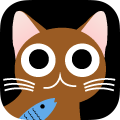
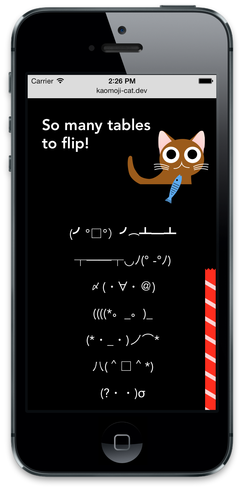

# Kaomoji Cat

Kaomojis are like emojis but in the form of text strings like:
this happy guy ＼（＠￣∇￣＠）／  
or
this dude flipping over a table (╯°□°）╯︵ ┻━┻

Kaomoji Cat is a webapp that helps you find the perfect kaomoji to express how you're feeling.

While there are way more kaomojis than emojis, kaomojis can be more flexible and expressive. I played off that quirky expressiveness with the character of the Kaomoji cat, fish and red string. The cat and his app hopefully comes across as cute, precocious and maybe a little bit creepy.

[Try it](http://kaomojicat.com/ "See Kaomoji Cat") 
[More details](http://pketh.org/Kaomoji-Cat)

<!--  -->

